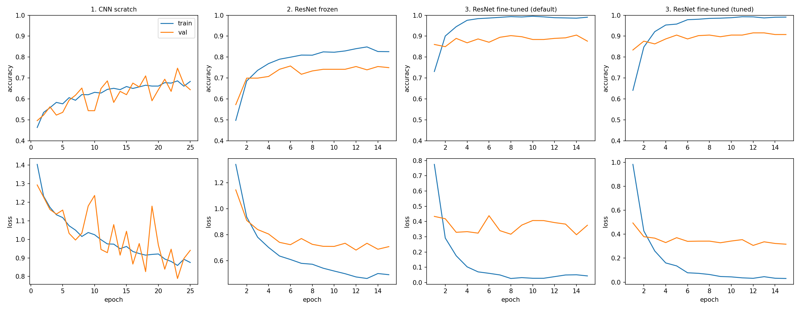
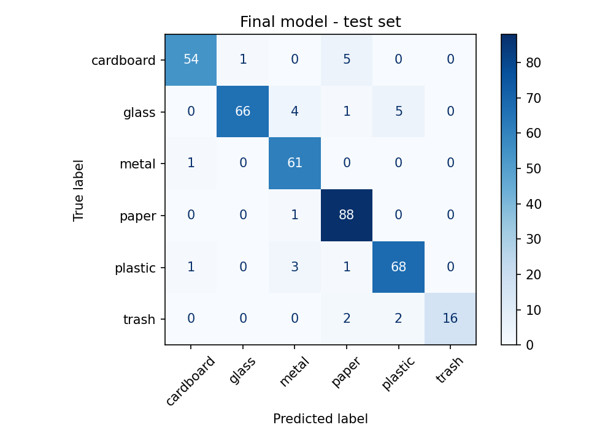
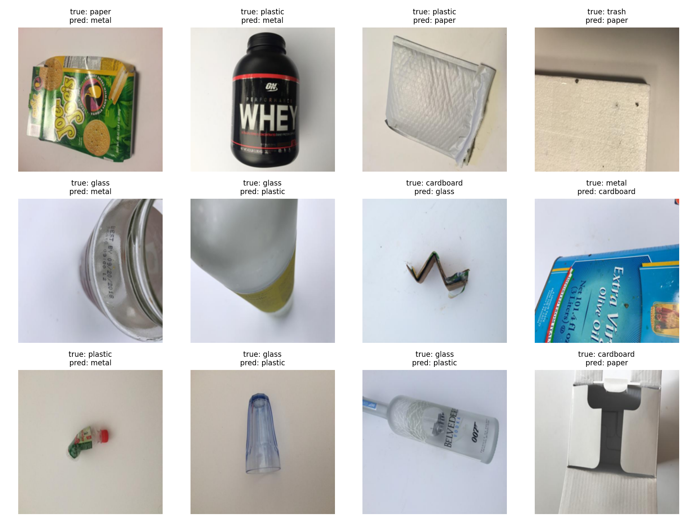

# Waste Classification for Recycling

A deep learning system that classifies images of waste into six categories — **cardboard, glass, metal, paper, plastic, trash** — to support automated recycling sorting.

## Overview

**What it does.** Given a photo of a waste item, the model predicts which of the six material categories it belongs to and returns a confidence score for each.

**Why it matters.** Sorting waste by hand is slow and error-prone, and the mistakes are expensive: a single misplaced item can contaminate an entire batch of otherwise recyclable material and send it to landfill. Automating the classification step lets recyclable materials be sorted more accurately and efficiently — which matters both for cutting processing costs and for reducing contamination in recycling streams.

**How it works.** Three deep learning architectures were built and compared — a CNN trained from scratch, a frozen pretrained ResNet-18, and a fully fine-tuned ResNet-18 — to study how much pretrained knowledge and fine-tuning improve performance. The fine-tuned ResNet-18 achieved the best result at **92.9% test accuracy** (380 test images).

## Dataset

[TrashNet](https://huggingface.co/datasets/garythung/trashnet) (`garythung/trashnet` on Hugging Face), photos of single waste items against plain backgrounds.

**Duplicate removal.** The Hugging Face version has 5,054 rows, but every photo appears twice: once under `dataset-original/` and once under `dataset-resized/`. Only the `dataset-resized` copy is kept, which leaves **2,527 unique images**.

> **Earlier results were inflated.** A previous version of this project split all 5,054 rows at random, so many test images had an exact copy in the training set. Those numbers (up to 92.1%) were inflated by this duplicate leakage. They have been replaced by the results below, which use the de-duplicated data.

The unique images are split 70/15/15, stratified by class, with seed 42:

| Split | Images |
|---|---|
| Train | 1,768 |
| Validation | 379 |
| Test | 380 |
| **Total** | **2,527** |

| Category | Images | In test set |
|---|---|---|
| Cardboard | 403 | 60 |
| Glass | 501 | 76 |
| Metal | 410 | 62 |
| Paper | 594 | 89 |
| Plastic | 482 | 73 |
| Trash | 137 | 20 |

The `trash` category (miscellaneous non-recyclable items) is noticeably underrepresented, at less than a quarter the size of `paper`.

## Method

The project is built in **PyTorch / torchvision** and was trained on a **Tesla T4 GPU (Google Colab)**. All three approaches use the same splits and are evaluated on the same held-out test set, so the numbers are directly comparable.

**Approach 1: CNN from scratch.** A small convolutional network (94,470 parameters) trained from random initialization, with no pretrained weights. This is the baseline. It shows what the dataset alone can support.

**Approach 2: ResNet-18, frozen backbone.** ResNet-18 pretrained on ImageNet with the convolutional backbone frozen. Only a new 6-class classifier head is trained (3,078 of 11,179,590 parameters). The pretrained features are reused as they are.

**Approach 3: ResNet-18, fine-tuned.** The same pretrained ResNet-18 with all layers unfrozen and updated together with the classifier head, so the network can adapt its features to waste images. It was trained twice: once with default settings, and once with a tuned configuration (learning rate 1e-4, weight decay 0.1, and a dropout 0.5 layer before the final linear layer). The tuned model is served by the demo app.

**Training setup (all approaches):**

- Inputs are resized to 224×224 (no crop) and normalized with ImageNet statistics:
  ```
  mean = [0.485, 0.456, 0.406]
  std  = [0.229, 0.224, 0.225]
  ```
- Light augmentation on the **training set only**: random horizontal flip and random rotation up to 15°. Validation and test images are not augmented.
- Best-validation checkpointing: the weights from the epoch with the highest validation accuracy are kept.
- The test set was evaluated **only once per final model**. All model selection and tuning used the validation set.

## Results

| Approach | Test accuracy | Training time | Trainable params |
|---|---|---|---|
| 1. CNN from scratch | 68.9% | 190.7 s | 94,470 |
| 2. ResNet-18 (frozen backbone) | 76.6% | 103.7 s | 3,078 of 11,179,590 |
| 3. ResNet-18 fine-tuned (default) | 89.2% | 138.5 s | 11,179,590 |
| 3. ResNet-18 fine-tuned (tuned: lr 1e-4, wd 0.1, dropout 0.5) | **92.9%** | 140.2 s | 11,179,590 |

Hardware: Tesla T4 (Google Colab), PyTorch. Raw numbers, including best validation accuracy, final training accuracy and best epoch: [`results/results_comparison_v2.csv`](results/results_comparison_v2.csv).

Transfer learning accounts for most of the gain. Moving from a scratch-trained CNN to frozen ImageNet features adds ~8 points, and fine-tuning the whole network adds another ~13 to 16 points.

### Honest notes on these numbers

- **Tuning gave no clear gain.** The tuned model scored 92.9% versus 89.2% for the default, but this difference is within noise. A 6-run grid over learning rate × weight decay plus 3 extra runs all scored within noise of each other, and repeated runs with identical settings varied by about 2 points.
- **The fine-tuned model still overfits.** Training accuracy reaches about 99%, while validation accuracy levels off around 91%.
- **The test set is small.** With 380 test images, each accuracy figure has a sampling error of roughly ±1.3 points.

### Learning curves



### Error analysis



The final model's most common mistakes on the test set:

| True → Predicted | Count |
|---|---|
| glass → plastic | 5 |
| cardboard → paper | 5 |
| glass → metal | 4 |
| plastic → metal | 3 |
| trash → paper | 2 |

Most errors happen between materials that look alike: transparent glass versus transparent plastic, shiny glass versus metal, and plain cardboard versus paper. Recall for `trash` is 80% (16 of 20), but with only 20 test images this estimate is very uncertain.

Examples of misclassified test images:



## Real-world testing

The classifier was tested on photos taken outside the dataset to see how well it generalizes beyond TrashNet's plain-background studio images.

> These observations come from the **earlier TensorFlow/MobileNetV2 version** of the project and have not yet been re-run against the current fine-tuned ResNet-18. The qualitative pattern is expected to hold, but the confidence figures are specific to the old model.

| Test image | Predicted | Confidence | Correct? | Notes |
|---|---|---|---|---|
| Plastic bottle, clean background | Plastic | 91.3% | ✅ | Single, clearly visible item — the case the model was trained for |
| Landfill pile (mixed waste) | Metal | 79.4% | ❌ | Cluttered multi-material scene; high confidence in a wrong answer |
| Crushed can pile | Plastic | 82.3% | ❌ | Many overlapping objects confuse a single-label classifier |
| Plastic bag in grass | Glass | 44.4% | ❌ | Camouflaged against a busy background; low confidence reflects the uncertainty |

The pattern is clear: the model is reliable on single items against plain backgrounds and unreliable on anything else.

## Limitations

- **Single-item assumption.** The model outputs one label per image, but real waste arrives in piles. On cluttered, multi-object scenes it picks one material and often reports high confidence while being wrong — a failure mode that is worse than an obvious error because it looks trustworthy.
- **Needs object detection for real scenes.** Handling multi-item images properly requires detecting and localizing each object first, e.g. with YOLO, then classifying each detection.
- **Background sensitivity.** Camouflaged items against busy backgrounds degrade badly — the training images are all shot on plain, uniform backgrounds.
- **Class imbalance.** The `trash` category has only 137 images in total (20 in the test set), so performance on genuinely non-recyclable items is the least trustworthy.
- **Dataset size.** 2,527 unique images is small, which is much of why Approach 1 lags so far behind the transfer-learning approaches, and why the fine-tuned model overfits.

## Demo app

[`app.py`](app.py) serves the tuned fine-tuned ResNet-18 through a Gradio interface: upload a photo, get probabilities across all six categories.

```bash
pip install -r requirements.txt
python app.py
```

The app expects `approach3_resnet_finetuned.pth` in the project root. If it is missing, the app exits with a message telling you where to get it.

## Model weights

| File | Approach | Where to get it |
|---|---|---|
| `approach1_cnn_scratch.pth` | CNN from scratch | **TODO: add new Google Drive link** (the old link points to outdated weights trained on the leaked split) |
| `approach2_resnet_frozen.pth` | ResNet-18, frozen backbone | **TODO: add new Google Drive link** (the old link points to outdated weights trained on the leaked split) |
| `approach3_resnet_finetuned.pth` | ResNet-18 fine-tuned (tuned) | Included in this repo (project root) |

To use approaches 1 and 2, place the downloaded `.pth` files in the project root.

## Project structure

```
waste-classifier/
├── app.py                             # Gradio demo app — serves the fine-tuned ResNet-18
├── requirements.txt                   # Python dependencies (PyTorch stack)
├── README.md                          # This file
├── .gitignore                         # Ignores Python cache files
├── approach3_resnet_finetuned.pth     # Final model weights (fine-tuned ResNet-18, tuned)
├── notebooks/
│   └── DLW.ipynb                      # PyTorch notebook: data loading, the three approaches, evaluation
├── results/
│   ├── results_comparison_v2.csv      # Current results: accuracy, time, params, hyperparameters per approach
│   ├── learning_curves_v2.png         # Current train/validation curves per approach
│   ├── confusion_matrix_v2.png        # Current confusion matrix of the final model on the test set
│   └── misclassified_v2.png           # Examples of misclassified test images
└── slides/                            # Presentation materials (currently empty)
```

## Tools used

- **PyTorch / torchvision** — model definition, training, and the pretrained ResNet-18
- **Hugging Face Datasets** — dataset loading
- **scikit-learn** — evaluation metrics and confusion matrices
- **matplotlib / seaborn / pandas** — results analysis and charts
- **Gradio** — demo interface
- **Google Colab (T4 GPU)** — model training
- **VS Code** — project organization

## Future work

- Collect or augment more data for the underrepresented `trash` category.
- Reduce overfitting in the fine-tuned model, e.g. with stronger augmentation or more data.
- Report results averaged over several seeds, since single runs vary by about 2 points.
- Re-run the real-world testing against the fine-tuned ResNet-18 to replace the older figures above.
- Explore YOLO for multi-item detection so cluttered scenes can be handled object by object rather than as a single label.

## AI use

Claude (Claude Code) was used to help debug PyTorch code, fix dataset loading issues, and restructure the project. All analysis and results in this repository represent my own work and were verified manually.
